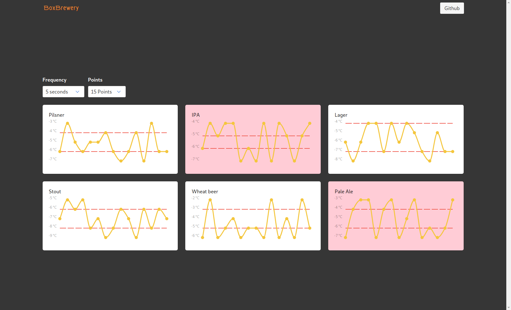

# Teste FrontEnd OneBox



demo: [click here](https://carlosqsilva.github.io/onebox-frontend-test)

```bash
git clone git@github.com:carlosqsilva/onebox-frontend-test.git
cd onebox-frontend-test
npm install
npm start
```

## Observação

Tive Problemas no uso da API (CORS) que não consegui resolver, utilizei a seguinte [extensão](https://chrome.google.com/webstore/detail/allow-control-allow-origi/nlfbmbojpeacfghkpbjhddihlkkiljbi) para poder dar continuidade no desenvolvimento.

**update 17/03(17:44):** aparentemente `/web` é o unico endpoint que não inclui `allow-access-control-origin: *`, fiz uma correção para ignorar o problema [#92a542d](https://github.com/carlosqsilva/onebox-frontend-test/commit/92a542d67807582f1193d3bf6b635fa3661634e1).

# Tech

Utilizei Create-react-app e as seguintes bibliotecas/framework:

* Preact + Preact-Compat
* Chartist.js
* Bulma Framework

# Informações

* What​ are​ the​ highlights​ of​ your​ logic / code​ writing​ style ?

Sinceramente não há nada de muito especial no código que mereça destaque, tentei escrever tudo em componentes cada um com sua propria logica, talvez esse deva ser o destaque _separation of concerns_.

* What could have been done in a better way ? What would you do in version 2.0 ?

Com certeza melhoraria o layout do site. Plotar a informação em graficos parecia uma ideia legal, mas não ficou tão legal, talvez outra forma de apresentar a informação seja mais adequada...

* What​ were​ the​ questions​ you​ would​ ask​ and​ your​ own​ answers / assumptions ?

Vocês pedem o uso de technologias javascript, decidi fazer um site pois a vaga pedia tecnologias web, mas acredito que poderia ter utilizado Electron, RN, ou nativeScript...

O _Case_ começa falando da _Carol_ mas termina pedindo uma solução para o _Shane_, quem é _Shane_? se a solução deva ser para _Carol_ Acredito que um site não seja a solução mais adequada, já que a _Carol_ estaria dirigindo, não teria tempo dela ficar site, mas enfim...
